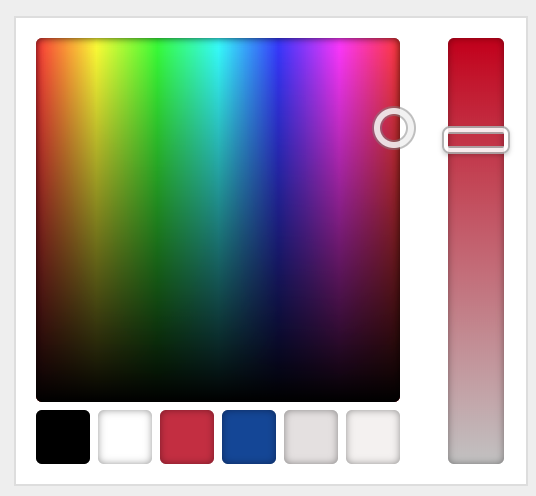
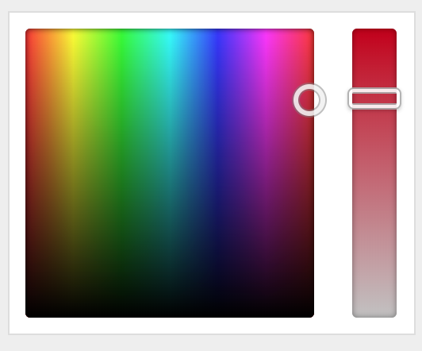

# Change the config of the Customizer Color Control

I needed to change the color palette, here's how I did it.

 

## Demo

I've added this validator to my [customizer demo theme](https://github.com/soderlind/2016-customizer-demo).

## Installing the validator

Clone this repository and include the [javascript code](customizer-color-control-change-config.js):

```php
add_action( 'customize_controls_enqueue_scripts', 'on_customize_controls_enqueue_scripts' );

function on_customize_controls_enqueue_scripts() {
	$handle = 'color-control-config';
	$src    = get_stylesheet_directory_uri() . '/js/customizer-color-control-change-config.js';
	$deps   = [ 'wp-color-picker' ];
	wp_enqueue_script( $handle, $src, $deps , rand());

	/**
	 * The options array. see the Iris Options at http://automattic.github.io/Iris/
	 *
	 * @type {Array}
	 */
	$options = [];

	wp_scripts()->add_data( $handle, 'data', sprintf( 'var _ColorControlConfig = %s;', wp_json_encode( $options ) ) );
}
```

## Some examples

### Change the palette

```php
$options = [
	'palettes' => [
		'#000000',
		'#ffffff',
		'#c32d41',
		'#144696',
		'#e4e0e0',
		'#f4f1f0',
	],
];
```


### Remove the palette

```php
$options = [
	'palettes' => [],
];

```


### Display the color control. Default is `'hide' => true`, i.e. you have to click the button to display it)

```php
$options = [
	'hide' => false,
];

```


## Copyright and License

Change the config of the Customizer Color Control is copyright 2017 Per Soderlind

Change the config of the Customizer Color Control is free software: you can redistribute it and/or modify it under the terms of the GNU General Public License as published by the Free Software Foundation, either version 2 of the License, or (at your option) any later version.

Change the config of the Customizer Color Control is distributed in the hope that it will be useful, but WITHOUT ANY WARRANTY; without even the implied warranty of MERCHANTABILITY or FITNESS FOR A PARTICULAR PURPOSE. See the GNU General Public License for more details.

You should have received a copy of the GNU Lesser General Public License along with the Extension. If not, see http://www.gnu.org/licenses/.
